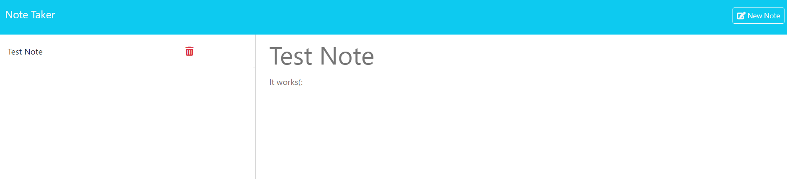

# Note-Taker-App

# Description

An application that allows users to be able to write and save notes so that they can organize their thoughts and keep track of tasks they need to complete

# Screenshot

# How to install

Open a new terminal and run npm i then node server.js.

Afterwards you should be notified that the application is running on local host 3001.

Open a new tab in your browser and type http://localhost:3001 and the application should be available.

# Usage

Click Get Started.

To add a note, type your note title and note description.

Once both areas ahve been filled out, a save icon will appear in the top right. Click it to save your note.

To view a note, click on the title to the left and the note will appear in the right.

To add note while a note is displayed, click the + button to reset the page.

To delete a note, click the red delete button to the right of the title.

To navigate to the homepage, click Note Taker in the top left.

# GitHub

https://github.com/MadieMalee
